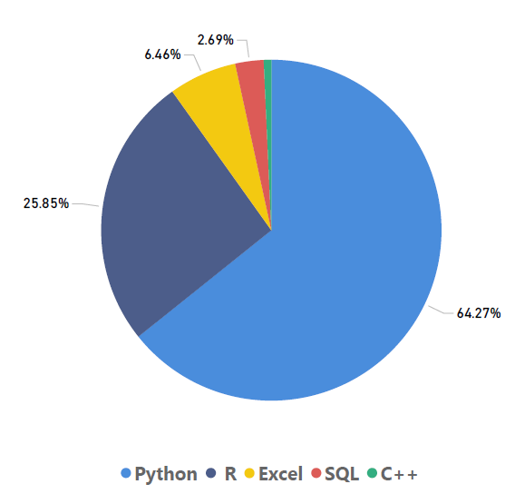
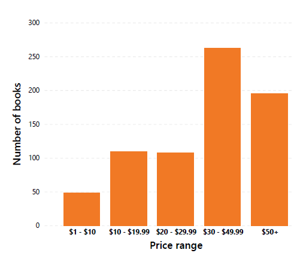

##  Amazon Data Science Books Analysis

This project explores a dataset of Data Science-related books from Amazon. The analysis aims to uncover patterns in book titles, pricing, popularity, and identify standout books in the Python and Machine Learning categories.

Data are taken from (https://www.kaggle.com/datasets/die9origephit/amazon-data-science-books/data/) 

### Tools I Used
For my deep dive into consumer complaints data, I used several important tools:

- **SQL** 
- **PostgreSQL** 
- **Visual Studio Code**
- **Power BI**
- **Git & GitHub** 

### Keyword Frequency in Titles

To understand the thematic focus of books in the dataset, we analyzed how frequently specific data and analytics tools appear in book titles. 

**Keywords checked:** `'Python'`, `'C++'`, `'SQL'`, `'R'`, `'Excel'`

### Price Distribution

To understand how books are priced, we grouped them into price ranges and counted how many fall into each bin.

The majority of books are priced between $30 and $49.99, making it the most common price range. A significant number of books are also priced at $50 or more, indicating a strong presence of higher-priced titles. In contrast, relatively few books fall into the lowest price range of $1 to $10, suggesting that cheaper books are less common in the dataset. Overall, the distribution is skewed toward mid-to-high price ranges.

### Review Outliers Relative to Rating & Price
We identified books that have a very high number of reviews compared to others in the same price range and with similar ratings. These may represent viral or highly popular books.

Approach:

Group books by price range.

Calculate average rating and number of reviews per group.

Flag books whose reviews significantly exceed the average in their price group.

|title |	book_rating	|no_reviews	|price_range	|
|------|-----------------|----------|--------------------|
|Hands-On Machine Learning with Scikit-Learn, Keras, and TensorFlow|	4.8	|3129	|40-60	|
Python Crash Course, 2nd Edition: A Hands-On, Project-Based Introduction to Programming	 |	4.7|	7767|	20-40	|

Learning Python, 5th Edition		|	4.5|	1724	|40-60	|
|Learning Python: Powerful Object-Oriented Programming|			4.5	|1724	|40-60	|
Python for Data Analysis: Data Wrangling with Pandas, NumPy, and IPython	|	4.6	|1686|	40-60	|
Pattern Recognition and Machine Learning (Information Science and Statistics)|	|4.6	687|	80+	|

### Best Python Book
Books with “Python” in the title were filtered and ranked by rating and number of reviews.

The best book for python is Python Crash Course, 2nd Edition: A Hands-On, Project-Based Introduction to Programming.
### Best Machine Learning Book
Similar to the Python book query but focused on titles containing "machine learning"

The best book for machine learning is Hands-On Machine Learning with Scikit-Learn, Keras, and TensorFlow: Concepts, Tools, and Techniques to Build Intelligent Systems.

### Conclusion
"Python" dominates book titles, reflecting its importance in data science.

Prices are concentrated in the $20–30 range.

A few books are outliers in terms of review volume, showing high reader engagement.

The top Python and Machine Learning books are standout performers in both rating and popularity.

